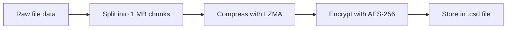
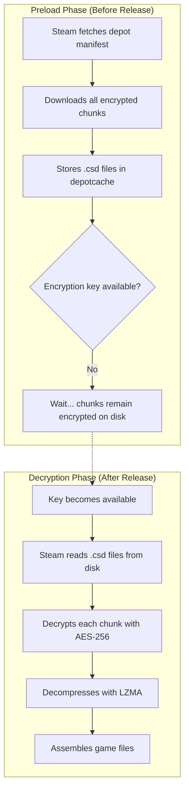

# Depot Keys & Steam's Download System

::: info
This page is a technical deep-dive into how Steam's download and preload system works under the hood, and how OpenSteamTool handles depot decryption. It's intended for developers and advanced users who want to understand the internals.
:::

Parts of this article are adapted from a [SteamDB blog post](https://steamdb.info/blog/steam-download-system/) by the SteamDB Team (March 2020).

## Overview

When you download a game through Steam, it's not a simple file copy. Steam uses a sophisticated content delivery system built around **depots**, **manifests**, and **encrypted chunks**. Understanding this system explains why depot keys are needed, how preloads work, and why OST needs to inject decryption keys in specific ways.

## Steam's Download Architecture

### Depots

A **depot** is the fundamental unit of game content on Steam. Every game is composed of one or more depots, each serving a different purpose:

- **Game files** — the main executable and assets
- **DLC files** — extra content bundled separately
- **Language packs** — localized audio and text
- **Redistributable packages** — DirectX, Visual C++, .NET Framework, etc.

Each depot is identified by a unique 32-bit depot ID, which can be seen in the app info.

### Depot Manifests

Every depot has a **depot manifest** — a file that acts as the table of contents for that depot's content at a specific version. The manifest is identified by a unique 64-bit manifest ID.

A manifest contains the following information:

| Field | Description |
|-------|-------------|
| **File list** | Encrypted file names, file sizes, file hashes, and file flags (directory, executable, etc.) |
| **Chunk metadata** | For each chunk: chunk ID, adler32 checksum, offset in the file, compressed and uncompressed sizes |
| **Encryption key ID** | Identifies which key was used to encrypt the chunks |

When Steam downloads a game, it first fetches the depot manifest to know what files exist and how they're split into chunks.

### Chunked Download & Encryption

Each file in a depot is split into roughly **one-megabyte chunks**. Each chunk goes through two transformations:



1. **LZMA compression** — A high-ratio compression algorithm (used by 7-Zip) that reduces download sizes
2. **AES-256 encryption** — A strong symmetric encryption standard that protects the content

All chunks in a depot share the same encryption key. This key is **unique to the depot** but **identical for all Steam users**. This design choice is deliberate: it allows CDNs to efficiently cache encrypted content and enables LAN cache servers to work without needing access to the decryption keys.

### The Encryption Key

The encryption key used for depot chunks is a **256-bit AES key**, represented as a 64-character hex string:

```
BCA9A9CDE94BB4DFF61849C6A87230EE45867A590FDD28826366E35E7D62C08E
```

This is the same key that OST refers to as a **depot decryption key** or **depot key** in Lua configuration.

#### Key Accessibility

The accessibility of the depot key depends on the game's release status:

| Status | Key Accessible? | Details |
|--------|:-:|---------|
| **Released game** | ✅ Yes | Any Steam user with access to the depot can request the key from Steam's servers |
| **Preload (unreleased)** | ❌ No | The key is withheld until the game officially releases |
| **Free-to-play game** | ✅ Yes | Keys are publicly accessible |

This distinction is critical for understanding preloads and OST's behavior.

## How Preloads Work

When you preload an unreleased game on Steam, the client downloads everything it can — all the encrypted chunks — but **cannot decrypt them** because the encryption key is not yet available.

Here's the flow:



The encrypted chunks are stored in `.csd` files inside the `depotcache` folder in your Steam directory.

### Performance Impact

When downloading a **released game**, decryption happens **while downloading** — the CPU decrypts chunks as they arrive, so there's no extra disk I/O.

When **decrypting a preload**, Steam has to:
1. **Read** the encrypted `.csd` files from disk
2. **Decrypt** each chunk
3. **Write** the decrypted data back to disk

This means preload decryption is **disk I/O bound**. If you have a slow hard drive but a fast internet connection, it may actually take **longer to decrypt a preload** than to re-download the game fresh after release.

## Why Brute-Forcing Depot Keys Is Impractical

A depot key is a 256-bit AES key. To understand how secure this is, consider the scale:

> Here's the depot key for CS:GO's depot 731 formatted in hex:\
> `BCA9A9CDE94BB4DFF61849C6A87230EE45867A590FDD28826366E35E7D62C08E`
>
> It is 256 bits long, and to brute-force it, you would need to exhaust 2²⁵⁶ possibilities.
>
> Fifty supercomputers that could check a billion billion (10¹⁸) AES keys per second would, in theory, require about **3×10⁵¹ years** to exhaust the 256-bit key space. At that point, the Earth and probably the universe itself are long gone.

### What About Quantum Computers?

Quantum computing often comes up in discussions about breaking encryption. However:

- **Shor's algorithm** (the famous quantum factoring algorithm) applies to **asymmetric** (public-key) encryption — like RSA or ECC — not symmetric encryption.
- **AES-256** is a **symmetric** encryption algorithm and is believed to be **quantum-resistant**.
- Quantum computers are not expected to reduce the attack time on AES-256 enough to be effective.

You can read more about AES-256 on [Wikipedia](https://en.wikipedia.org/wiki/Advanced_Encryption_Standard).

## How OST Handles Depot Decryption

### Key Injection from Lua Config

OST hooks into Steam's `ConfigStoreGetBinary` function to intercept requests for depot decryption keys. When Steam needs a key for a depot (e.g. `...\<DepotId>\DecryptionKey`), OST intercepts the call and checks if a key was provided in Lua config:

1. Steam requests the decryption key for a specific depot
2. OST intercepts the request via `ConfigStoreGetBinary`
3. OST looks up the depot in `LuaConfig::GetDecryptionKey(depotId)`
4. If a matching key is found, OST injects it into Steam's decryption engine
5. If no key is found, OST falls through to Steam's original `ConfigStoreGetBinary` — which returns whatever Steam has cached (if anything)

In practice, **community Lua sources provide depot keys for almost every game**. OST does **not** fetch depot keys from Steam's servers automatically — it only injects keys explicitly provided via the third argument of `addappid()`.

#### When a Key May Not Be Needed

- **Family Shared games**: If the game is genuinely owned by another Steam user on the same machine, Steam may already have the depot key cached in its ConfigStore from that account.
- **Free-to-play games**: Depot keys are publicly accessible to all users.

For all other unlocked games, **providing the depot key is expected**.

### Manual Keys in Lua

Some games require the depot key to be explicitly provided. The third argument to `addappid()` is the depot decryption key:

```lua
-- addappid(appid, depotId, depotKey)
addappid(1361511, 0, "5954562e7f5260400040a818bc29b60b335bb690066ff767e20d145a3b6b4af0")
```

Parameters:
- **appid** — The Steam AppID of the game
- **depotId** — Optional depot ID (use `0` for auto-detect or default depot)
- **depotKey** — The 64-character hex AES-256 key

OST stores the key and injects it into Steam's depot decryption system when the corresponding depot is being downloaded or accessed.

### Preload Support

OST supports preloaded games through the same depot decryption mechanism. Once the encryption key becomes available (after the game's release), OST can inject it to decrypt the preloaded `.csd` files. However, because decryption requires reading and writing the full depot to disk, the performance considerations mentioned above still apply.

### Debug Logging

If you're troubleshooting depot decryption issues, enable the Debug build and check `decryptionkey.log`:

```
<Steam>/opensteamtool/decryptionkey.log
```

This log shows which keys are being injected and whether the injection succeeded.

## References

- [Steamworks documentation](https://partner.steamgames.com/doc/features/workshop) — Official Steam documentation on the content system
- [DepotDownloader](https://github.com/SteamRE/DepotDownloader) — Open-source tool for downloading Steam depots, useful reference implementation
- [SteamDB blog: Steam download system](https://steamdb.info/blog/steam-download-system/) — Original article by the SteamDB Team
- [Advanced Encryption Standard (Wikipedia)](https://en.wikipedia.org/wiki/Advanced_Encryption_Standard) — AES-256 specification and security properties
