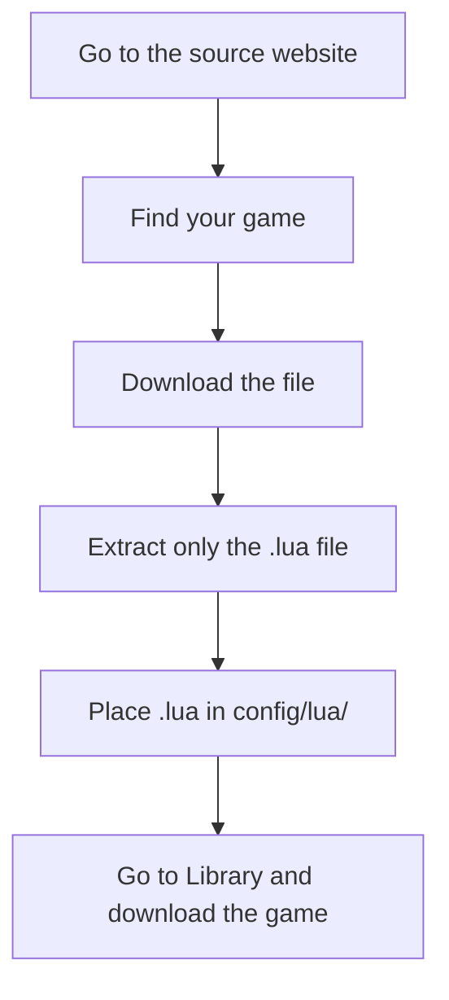

# Getting Started (User Guide)

::: info Community-Supported Guide
This guide is **community-maintained** and not an official OpenSteamTool resource.
:::
::: tip First time? Read the [Concepts & Glossary](/user/concepts) page first
It explains all the technical terms used here — DLLs, AppIDs, Lua, Denuvo, and more — so you know exactly what you're installing.
:::
## Before You Install — What OST Does

**OpenSteamTool (OST)** is a tool that runs inside your Steam client to unlock games you don't own. It works by placing special DLL files in your Steam folder that intercept Steam's ownership checks and tell it "this game is okay to play."

**Key things to understand:**
- OST does **not** download cracked or pirated game files — games are downloaded from Steam's own servers
- OST does **not** modify game files — it only changes what Steam thinks you own
- You configure it with small text files (`.lua`) that you can download from community websites
- You still need to **install the game through Steam** after setting up OST
- Some games with strong DRM (Denuvo) need extra configuration

Now that you know what you're installing, follow the steps below.

This guide is for **non-technical users** who just want to unlock games with OpenSteamTool. If you're a developer looking for the full technical reference, check the [Developer Guide](/guide/lua/api).

## Step 1: Close Steam

Before doing anything, **fully close Steam** — right-click the Steam icon in your system tray and select **Exit**. OpenSteamTool files cannot be replaced while Steam is running.

## Step 2: Download OpenSteamTool

Go to the [OpenSteamTool releases page](https://github.com/OpenSteam001/OpenSteamTool/releases) and download the latest release ZIP.

For normal use, download the **Release** variant (e.g. `OpenSteamTool-x.x.x-Release.zip`).

## Step 3: Extract the Archive

Extract the ZIP file. You'll see these files inside:

```
OpenSteamTool-x.x.x-Release/
├── OpenSteamTool.dll
├── dwmapi.dll
├── dwmapi.exp
├── dwmapi.lib
├── lua_static.lib
├── xinput1_4.dll
├── xinput1_4.exp
└── xinput1_4.lib
```

Extract **all contents** to a folder — you'll use them all in the next step.

## Step 4: Copy All Files to Your Steam Folder

Copy every file from the extracted folder into your **Steam root directory** — the folder where `steam.exe` lives.

Typical location:

```
C:\Program Files (x86)\Steam\
```

::: warning Antivirus False Positives
OpenSteamTool uses DLL proxy techniques that may trigger **false positives** from some antivirus software. This is common with tools that hook into game processes.

If your antivirus quarantines or blocks the DLLs:

1. **Add an exception** — Add your Steam folder (`C:\Program Files (x86)\Steam\`) to your antivirus exclusion list
2. **Try the Debug version** — Download the Debug variant of the release instead — the debug build has different signatures and may bypass overly aggressive heuristics
3. **Verify yourself** — OST is fully open source. You can inspect the code on [GitHub](https://github.com/OpenSteam001/OpenSteamTool) or build it yourself if you're concerned

After adding an exception or switching to the Debug build, re-extract all files and copy them again.
:::
After copying, your Steam folder should look like this:

```
C:\Program Files (x86)\Steam\
├── steam.exe
├── steamclient64.dll
├── dwmapi.dll          ✓ (new)
├── dwmapi.exp          ✓ (new)
├── dwmapi.lib          ✓ (new)
├── lua_static.lib      ✓ (new)
├── xinput1_4.dll       ✓ (new)
├── xinput1_4.exp       ✓ (new)
├── xinput1_4.lib       ✓ (new)
├── OpenSteamTool.dll   ✓ (new)
├── config/
└── ...
```

## Step 5: Create the Lua Folder

Create this folder inside your Steam directory (only if it doesn't exist yet):

```
C:\Program Files (x86)\Steam\config\lua\
```

::: warning
Use `config\lua` — **not** `config\stplug-in`! The `stplug-in` folder is for a completely different system and will **not** work with OpenSteamTool.
:::

## Step 6: Launch Steam

Start Steam normally. OpenSteamTool loads automatically through the DLLs you placed in the Steam folder.

## Step 7: Get Lua Configuration Files

OpenSteamTool needs Lua (`.lua`) files to know which games to unlock. **You do not need to write these yourself.** You can get ready-made Lua files from community sources. With Steam running, OST automatically detects any new `.lua` file you add — no restart needed.

See the **[Lua Sources guide](/user/lua-sources)** for full instructions on each source, download limits, and ratings.

### Quick Steps

1. Go to a [source website](/user/lua-sources)
2. Find your game and download the `.lua` file
3. Place it in your `config\lua\` folder
4. Go to your **Steam Library** — the game should appear. Click **Install** (or **Play** if already installed).



> **Download fails with a license error?** Close Steam fully (Exit from system tray), then reopen it. This refreshes Steam's license cache so it picks up the new configuration.

### Important Disclaimers

::: danger DO NOT download external tools
Some sources may mention or link to **external tools, launchers, or "managers"**. **Do not download or run them.** They are not part of OpenSteamTool, may be malicious, and are completely unnecessary. All you need is the `.lua` file.
:::
::: warning Only get the .lua file
From the downloaded archive, take **only the `.lua` file** and place it in your `config\lua\` folder. **Do not** grab any manifest files, executables, installers, or other files that may be included in the download. Let OpenSteamTool download everything else it needs on its own.
:::
### What a Lua File Looks Like

This is the kind of file you'll get from those sources:

```lua
-- Example game configuration
addappid(1361510)
addappid(1361511, 0, "5954562e7f5260400040a818bc29b60b335bb690066ff767e20d145a3b6b4af0")
addtoken(1361510, "2764735786934684318")
```

You can have multiple `.lua` files in `config\lua\` — one per game or one for all games. OST loads all of them.

**That's it.** No complex configuration needed.

## Next Steps

- **[Playing Online](/user/online-play)** — Enable multiplayer with `-onlinefix` or third-party patches
- **[FAQ](/user/troubleshooting/faq)** — Fix common issues

## Updating

To update OpenSteamTool:

1. Close Steam
2. Download the new release ZIP
3. Extract all files
4. Replace all files in your Steam folder
5. Launch Steam

Your Lua files and any config are preserved.

## Need Help?

If something doesn't work, check the [Debug Logging section](/guide/advanced/debug-logging) guide or visit the [GitHub repository](https://github.com/OpenSteam001/OpenSteamTool) for support.
